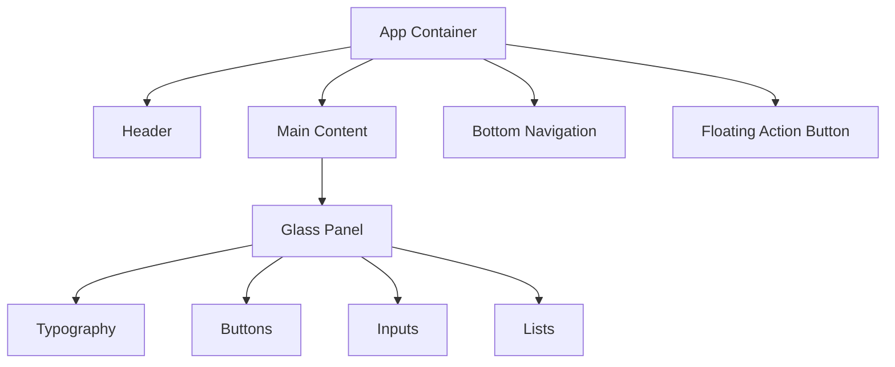
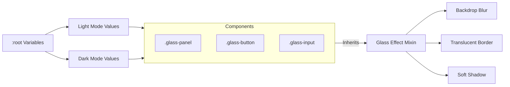

# Liquid Glass UI - Developer Guide

Welcome to the **Liquid Glass UI** developer documentation. This guide provides everything you need to reuse and implement our modern, glassmorphism-based component library in your projects.

## 🚀 Introduction

Liquid Glass UI is a lightweight, CSS-first library designed to create stunning, modern web interfaces with a "glass" aesthetic. It features:
-   **Glassmorphism**: Frosted glass effects with dynamic lighting.
-   **Pastel Color Palette**: Soft, pleasing colors that adapt to dark mode.
-   **Fluid Animations**: Subtle floating and glowing effects.
-   **Responsive Design**: Mobile-first components.

## 📦 Installation & Setup

To use Liquid Glass UI in your project, simply include the core CSS file.

### 1. Directory Structure
Ensure your project has the following structure to match the library's expectations:

```text
project-root/
├── style.css           # Core library styles
├── js/
│   └── app.js          # (Optional) Dynamic interactions
├── index.html
```

### 2. HTML Template
Add the following to your HTML `<head>`:

```html
<!DOCTYPE html>
<html lang="en">
<head>
    <meta charset="UTF-8">
    <meta name="viewport" content="width=device-width, initial-scale=1.0">
    <title>My Liquid App</title>
    <!-- Core Styles -->
    <link rel="stylesheet" href="style.css">
    <!-- Google Fonts -->
    <link href="https://fonts.googleapis.com/css2?family=Inter:wght@400;500;600&display=swap" rel="stylesheet">
</head>
<body>
    <div class="app-container">
        <!-- Your Content Here -->
    </div>
    <script src="js/app.js"></script>
</body>
</html>
```

## 🔬 CSS Deep Dive: How It Works

Understanding the magic behind the "Liquid Glass" effect will help you customize it effectively.

### 1. The Liquid Glass Recipe
The signature look is achieved by layering multiple CSS properties on the `.glass-panel` class:

```css
.glass-panel {
    /* 1. Semi-transparent background base */
    background: var(--glass-bg); /* rgba(255, 255, 255, 0.3) */
    
    /* 2. The Frost Effect */
    backdrop-filter: blur(20px) saturate(180%);
    -webkit-backdrop-filter: blur(20px) saturate(180%);
    
    /* 3. Subtle Border for Definition */
    border: 1px solid var(--glass-border); /* rgba(255, 255, 255, 0.5) */
    
    /* 4. Soft Shadow for Depth */
    box-shadow: var(--glass-shadow);
}
```

-   **`backdrop-filter`**: This is the key. `blur()` creates the frosted look, while `saturate()` boosts the colors of whatever is behind the glass, making it pop.
-   **`rgba()` Background**: We use a very low opacity white (or black in dark mode) to tint the glass without hiding the background.

### 2. Lighting & Reflections
To make the glass feel physical, we add a "shine" or reflection using a pseudo-element (`::before`).

```css
.glass-panel::before {
    content: '';
    position: absolute;
    inset: 0; /* Covers the whole panel */
    
    /* Diagonal gradient from white to transparent */
    background: linear-gradient(135deg, rgba(255, 255, 255, 0.6) 0%, rgba(255, 255, 255, 0) 50%);
    
    opacity: 0.5;
    pointer-events: none; /* Let clicks pass through */
}
```
This creates a highlight in the top-left corner, simulating a light source.

### 3. Floating Animation
The "Liquid" part comes from the gentle, continuous movement.

```css
@keyframes float {
    0%, 100% { transform: translateY(0px); }
    50% { transform: translateY(-8px); }
}

.glass-panel {
    animation: float 6s ease-in-out infinite;
}
```
This simple keyframe moves the element up and down. We use different durations (e.g., `6s`, `8s`) for different elements to make the movement feel organic and not robotic.

## 🎨 Core Concepts & Theming

### Theming Variables
The library is built on CSS variables. Override these in your `:root` to change the look instantly.

```css
:root {
    /* Core Colors */
    --bg-color: #f8fdff;
    --text-color: #1c1b1f;
    
    /* Pastels */
    --primary-pastel: #d3e3fd;   /* Blue-ish */
    --secondary-pastel: #c4eed0; /* Green-ish */
    --tertiary-pastel: #f8d7da;  /* Red-ish */
    
    /* Glass Settings */
    --glass-blur: 20px;
    --glass-saturate: 180%;
}
```

### Dark Mode
Dark mode redefines these variables. The glass background becomes `rgba(255, 255, 255, 0.05)` (faint white) to create a "smoked glass" look on the dark background.

## 🧩 Component Reference

### 1. Glass Panel
The foundation of the UI. Use this for cards, sections, or containers.

```html
<div class="glass-panel">
    <h3>Card Title</h3>
    <p>This is a content inside a glass panel.</p>
</div>
```

### 2. Buttons
Buttons come in standard and primary variants.

```html
<!-- Standard Glass Button -->
<button class="glass-button">
    Click Me
</button>

<!-- Primary Action Button -->
<button class="glass-button primary">
    Submit
</button>
```

### 3. Inputs
Styled text inputs with focus effects.

```html
<input type="text" class="glass-input" placeholder="Enter your name">
```

### 4. Lists
Perfect for settings menus or data lists.

```html
<div class="glass-panel">
    <div class="list-item">
        <span>Item 1</span>
        <small>Details</small>
    </div>
</div>
```

### 5. Navigation
#### Header
A sticky, floating header.

```html
<header class="header flex justify-between items-center">
    <h1>My App</h1>
    <button class="theme-toggle">
        <!-- Icon -->
    </button>
</header>
```

#### Bottom Navigation
A floating bottom bar for mobile apps.

```html
<nav class="bottom-nav">
    <a href="#" class="nav-item active">
        <span>Home</span>
    </a>
</nav>
```

## 📊 Architecture Diagrams

### Component Hierarchy


### Theming System


## 🛠️ Utilities

| Class | Description |
| :--- | :--- |
| `.flex` | `display: flex` |
| `.flex-col` | `flex-direction: column` |
| `.items-center` | `align-items: center` |
| `.justify-between` | `justify-content: space-between` |
| `.gap-sm/md` | Spacing gaps |
| `.p-md` | Padding medium (16px) |
| `.mt-md` | Margin top medium (16px) |
| `.hidden` | `display: none` |

---
*Generated for Liquid Glass UI Library*
